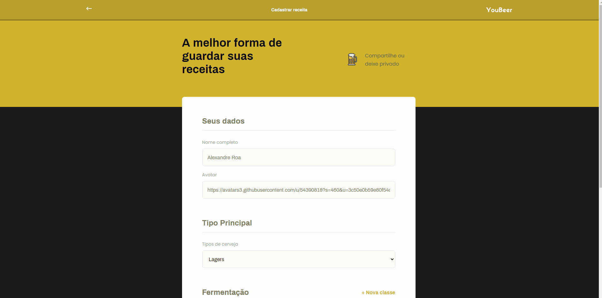
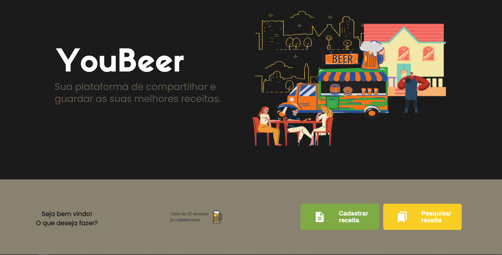
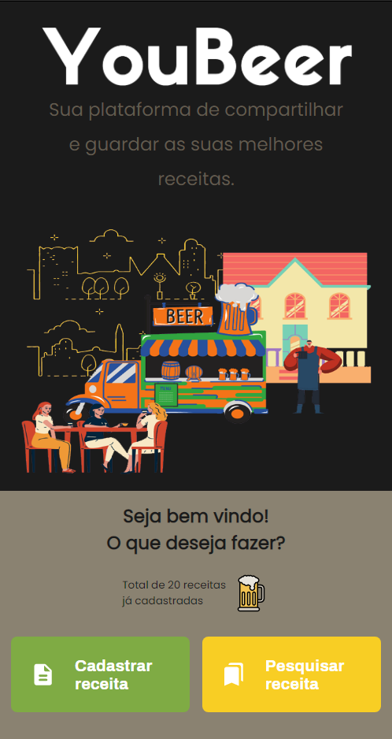

<h1 align="center">
 
  
 
</h1>

Hub for beer recipes.

  
  
  

---

# See the repositories

### - [Backend](https://github.com/alexandre-roa/youBeer-server)

---

## 🚀 Technologies

This project was developed with the following technologies:

- ✔️ Typescript

- ✔️ ReactJS

- ✔️ React Native

- ✔️ NodeJS

- ✔️ React Hooks

- ✔️ Sqlite3

- ✔️ Axios

Made with 💜 by Alexndre Roa 👋 [See my linkedin](https://www.linkedin.com/in/azaroa/)